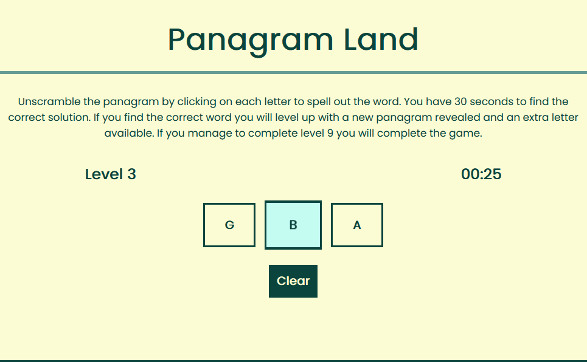

# Panagram Land

## Description

Provide a short description explaining the what, why, and how of your project. Use the following questions as a guide:

- What was your motivation?
- Why did you build this project? (Note: the answer is not "Because it was a homework assignment.")
- What problem does it solve?
- What did you learn?

Panagram land is an original word game that is playable on laptop/desktop and mobile. The aim of the game is to unscramble a scrambled word by rearranging the letters within a 30 second time limit. Each time the user successfully unscrambles a word within the 30 second limit the game levels up, with a new word loaded this time 1 letter longer. The game starts with a 3 letter problem, levelling up to a 9 letter word which if solved, the game is completed. When the game ends a modal loads to the page, displaying the outcome of the game to the user and allowing the user to input their name and submit this to local storage. The user can visit to the high scores page and will see their name and level achieved, with this information being stored and reloaded when the page is closed and re-opened.  



The game is programmed in HTML, CSS and Javascript. I extended the colour theme from my founders and coders application webpage, as well as utilising similar hover effects. I also implemented some CSS animations in order to add some flare to the visual experience. I took a functional approach to programming the game logic, with JSON logic applied to perist high scores to local storage. 

## Table of Contents (Optional)

If your README is long, add a table of contents to make it easy for users to find what they need.

- [Installation](#installation)
- [Usage](#usage)
- [Credits](#credits)
- [License](#license)

## Installation

What are the steps required to install your project? Provide a step-by-step description of how to get the development environment running.

## Usage

Provide instructions and examples for use. Include screenshots as needed.

To add a screenshot, create an `assets/images` folder in your repository and upload your screenshot to it. Then, using the relative filepath, add it to your README using the following syntax:

    ```md
    
    ```

## Credits

List your collaborators, if any, with links to their GitHub profiles.

If you used any third-party assets that require attribution, list the creators with links to their primary web presence in this section.

If you followed tutorials, include links to those here as well.

## License

The last section of a high-quality README file is the license. This lets other developers know what they can and cannot do with your project. If you need help choosing a license, refer to [https://choosealicense.com/](https://choosealicense.com/).

---

🏆 The previous sections are the bare minimum, and your project will ultimately determine the content of this document. You might also want to consider adding the following sections.

## Badges


Badges aren't necessary, per se, but they demonstrate street cred. Badges let other developers know that you know what you're doing. Check out the badges hosted by [shields.io](https://shields.io/). You may not understand what they all represent now, but you will in time.

## Features

If your project has a lot of features, list them here.

## How to Contribute

If you created an application or package and would like other developers to contribute it, you can include guidelines for how to do so. The [Contributor Covenant](https://www.contributor-covenant.org/) is an industry standard, but you can always write your own if you'd prefer.

## Tests

Go the extra mile and write tests for your application. Then provide examples on how to run them here.