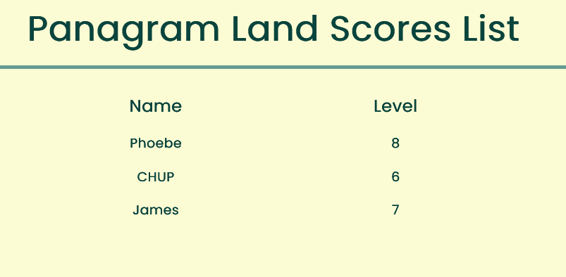
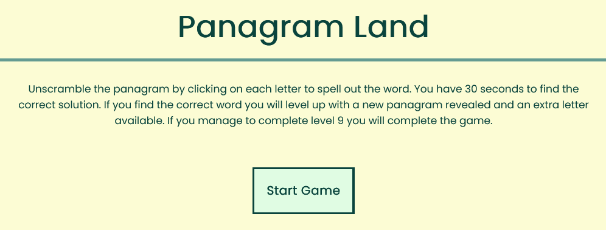
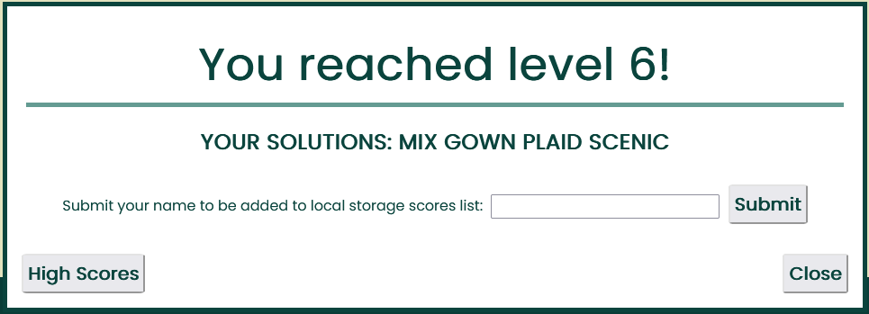

# Panagram Land

   

Panagram land is an original word game that is playable on laptop/desktop and mobile. The aim of the game is to unscramble a scrambled word by rearranging the letters within a 30 second time limit. Each time the user successfully unscrambles a word within the 30 second limit the game levels up, with a new word loaded this time 1 letter longer. The game starts with a 3 letter problem, levelling up to a 9 letter word which if solved, the game is completed. When the game ends a modal loads to the page, displaying the outcome of the game to the user and allowing the user to input their name and submit this to local storage. The user can visit to the high scores page and will see their name and level achieved, with this information being stored and reloaded when the page is closed and re-opened.  

The game is programmed in HTML, CSS and Javascript. I extended the colour theme from my founders and coders application webpage, as well as utilising similar hover effects. I also implemented some CSS animations in order to add some flare to the visual experience. I took a functional approach to programming the game logic, with JSON logic applied to perist high scores to local storage. 

My motivation for this was project was to develop an enjoyable game that can be played multiple times and still be enjoyable for the user. I also wanted to strengthen and develop my logic building skills in javascript, building a project in a structured and organised fashion by implementing JS modules. In creating this project I learned skills in CSS animations, JS modules, fucntional programming, RegEx, objects, local storage persistence and manipulating the DOM.

## Table of Contents

- [Installation](#installation)
- [Usage](#usage)
- [Credits](#credits)
- [License](#license)
- [Features](#features)
- [Tests](#tests)
- [AI](#ai)

## Installation

No installation neccessary, the site is deployed via GitHub pages at the following link:

https://jamesrobertsutcliffe.github.io/fc-game/

## Usage

The website is intuitive and straightforward to use on desktop and mobile. There are some features to look out for. 

- Read the the game rules and then hit the start button to begin play.

- When making a guess using all character wait for the 3 second animation to complete.

- If the timer runs out or you complete level 9, await the animation to complete to reveal a modal displaying the outcome of the game. Enter your name (a single word using letters only) and submit this to save your entry to the high scores local storage list. Click on the 'High Scores' button to view the high scores list. This page is also accessible in the footer.  

## Credits

- The Founders and Coders community for setting this task and supporting me throughout. 

https://www.foundersandcoders.com/

- Web Dev simplified YouTube channel for providing a tutorial on creatings modals in HTML, CSS and JS.

https://www.youtube.com/@WebDevSimplified

- Chat GPT for acting co-piloting the development of this website. See AI section at bottom of this doc for more in depth information on the utilisation.

https://openai.com/blog/chatgpt

## License

MIT License.

## Features

- Word game built using functional approach in Javascript.
- Defined colour scheme.
- CSS animations and interactive effects. 
- Responsive to screen size. 
- Modals.
- JSON logic driven local storage persistence high scores list.

## Tests

Go the extra mile and write tests for your application. Then provide examples on how to run them here.

## AI

I have utilised chat GPT as a co-pilot when building this website. Below are some examples of prompts I used in aid of this project.  

- To refresh my knowledge of DOM method query selector all and it's functionality. 

- To help me build the color theme toggle feature.

